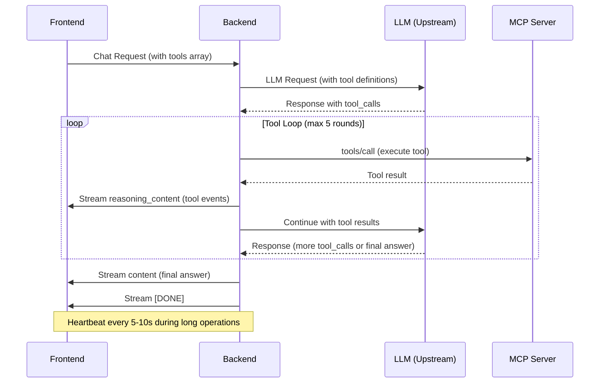
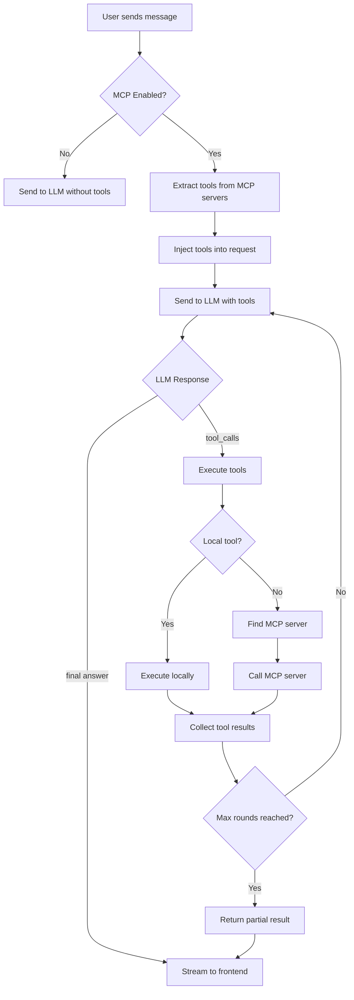

# MCP (Model Context Protocol) User Manual

This manual provides comprehensive guidance for using MCP (Model Context Protocol) in the GPTChat application. MCP enables AI models to interact with external tools and services, extending their capabilities beyond text generation.

## Table of Contents

- [MCP (Model Context Protocol) User Manual](#mcp-model-context-protocol-user-manual)
  - [Table of Contents](#table-of-contents)
  - [Overview](#overview)
  - [For End Users](#for-end-users)
    - [What is MCP?](#what-is-mcp)
    - [Enabling MCP](#enabling-mcp)
    - [Using MCP Tools](#using-mcp-tools)
    - [Understanding Tool Call Output](#understanding-tool-call-output)
  - [For Administrators](#for-administrators)
    - [Configuration Overview](#configuration-overview)
    - [Adding MCP Servers](#adding-mcp-servers)
      - [Using mcp.laisky.com (Default Server)](#using-mcplaiskycom-default-server)
    - [Syncing Tools](#syncing-tools)
    - [Managing Tool Access](#managing-tool-access)
    - [Backend Configuration](#backend-configuration)
  - [Troubleshooting](#troubleshooting)
    - [Tools Not Appearing](#tools-not-appearing)
    - [Tool Calls Failing](#tool-calls-failing)
    - [Timeout Errors](#timeout-errors)
    - [Common Error Messages](#common-error-messages)
    - [Getting Help](#getting-help)
  - [Appendix: MCP Protocol Details](#appendix-mcp-protocol-details)
    - [Protocol Flow](#protocol-flow)
    - [Request/Response Flow (Detailed)](#requestresponse-flow-detailed)
    - [Tool Definition Schema](#tool-definition-schema)
    - [Supported MCP Endpoints](#supported-mcp-endpoints)

---

## Overview

MCP (Model Context Protocol) is a standardized protocol that allows AI language models to interact with external tools and services. When MCP is enabled, the AI can:

- Call external APIs and services
- Execute code and scripts
- Search databases and knowledge bases
- Interact with file systems
- Perform web searches and fetch web content
- And much more, depending on the available tools

The GPTChat application supports MCP through remote MCP servers that expose tool definitions and execution endpoints.

---

## For End Users

### What is MCP?

MCP allows the AI assistant to go beyond simple text generation by giving it access to tools. When you ask a question that requires real-time data, calculations, or external service interaction, the AI can use these tools to provide better answers.

**Example use cases:**

- "Search the web for the latest news about AI"
- "What's the current weather in Tokyo?"
- "Calculate the hash of this text"
- "Fetch the content of this URL"

### Enabling MCP

1. Open the **Settings Sidebar** by clicking the gear icon in the chat interface
2. Find the **MCP Tools** toggle button (🔧 icon) at the bottom of the chat input area
3. Click the toggle to enable MCP - it will turn blue when active

Alternatively, in the Settings Sidebar:

1. Scroll to the **MCP Servers** section
2. Toggle the **Enable MCP** switch to ON

### Using MCP Tools

Once MCP is enabled, you can interact with the AI as normal. The AI will automatically decide when to use tools based on your questions.

**Tips for effective tool usage:**

- Be specific about what you need (e.g., "Fetch the content from https://example.com" instead of "Check this link")
- The AI will explain what tools it's using in the response
- Complex tasks may require multiple tool calls

### Understanding Tool Call Output

When the AI uses MCP tools, you'll see a collapsible **"💭 Reasoning & Tools"** section in the response. This shows:

- **🔧 Tool Events**: A log of which tools were called and their results
  - `Upstream tool_call: <tool_name>` - The AI requested this tool
  - `args: {...}` - The arguments passed to the tool
  - `exec MCP tool: <tool_name> @ <server_url>` - Tool execution details
  - `tool ok` - Tool executed successfully
  - `tool error: <message>` - Tool execution failed

Click on the "💭 Reasoning & Tools" header to expand or collapse this section.

---

## For Administrators

### Configuration Overview

MCP configuration is stored per-session in the browser's IndexedDB. Each chat session can have different MCP server configurations, allowing users to customize tool access for different use cases.

The configuration includes:

- **MCP Servers**: List of remote MCP server endpoints
- **Tool Definitions**: Cached tool schemas from each server
- **Enabled Tools**: Which specific tools are active

### Adding MCP Servers

1. Open the **Settings Sidebar**
2. Navigate to the **MCP Servers** section
3. Click **Add Server**
4. Fill in the server details:
   - **Name**: A friendly name for the server (e.g., "Web Tools")
   - **URL**: The MCP server endpoint (e.g., `https://mcp.laisky.com`)
   - **API Key**: Authentication key (required for most servers)
5. Click **Save**
6. The application will automatically sync available tools

#### Using mcp.laisky.com (Default Server)

The default MCP server at `https://mcp.laisky.com` provides the following tools:

| Tool               | Description                                              |
| ------------------ | -------------------------------------------------------- |
| `web_search`       | Search the web using Google Programmable Search          |
| `web_fetch`        | Fetch and render dynamic web page content                |
| `ask_user`         | Ask the authenticated human for input and wait for reply |
| `get_user_request` | Get the latest directive queued by the user              |
| `extract_key_info` | Extract key information from materials using RAG         |
| `mcp_pipe`         | Execute a pipeline composing multiple MCP tools          |

**Configuration for mcp.laisky.com:**

- **URL**: `https://mcp.laisky.com`
- **API Key**: Your Laisky API key (same as the chat API key, e.g., `sk-xxx...`)

**Important Notes:**

- The `web_search` tool incurs a cost per query (billed through your API key)
- The `ask_user` tool requires you to have the [Ask User Console](https://mcp.laisky.com/mcp/tools/ask_user) open to respond
- The `get_user_request` tool uses the [User Requests Console](https://mcp.laisky.com/mcp/tools/get_user_requests)

### Syncing Tools

After adding or modifying an MCP server, you should sync its tools:

1. Click the **Sync** button (🔄 icon) next to the server name
2. Wait for the sync to complete
3. The number of available tools will be displayed

**What happens during sync:**

1. The frontend sends an initialization request to the MCP server
2. The server responds with a session ID and protocol version
3. The frontend queries `tools/list` to get available tool definitions
4. Tool schemas are cached locally for inclusion in API requests

### Managing Tool Access

You can control which tools are available:

**Enable/Disable a Server:**

- Toggle the switch next to the server name
- Disabled servers won't contribute tools to requests

**Select Specific Tools:**

- Click on a server to expand its tool list
- Check/uncheck individual tools
- Only checked tools will be sent to the AI

### Backend Configuration

The backend handles MCP tool execution. Key configuration options in `settings.yml`:

```yaml
openai:
  # Maximum number of tool-loop iterations
  tool_loop_max_rounds: 5

  # Rate limiting for freetier users (seconds between MCP calls)
  rate_limit_expensive_models_interval_secs: 600
```

**Backend behavior:**

1. Receives requests with tools and MCP server configurations
2. Sends requests to upstream LLM with tool definitions
3. When the LLM requests tool calls:
   - Tries local tools first (built-in functions)
   - Falls back to MCP servers for external tools
4. Executes tools and feeds results back to the LLM
5. Loops until the LLM provides a final answer or max rounds reached
6. Streams thinking/tool events via `delta.reasoning_content`
7. Sends periodic heartbeats to prevent frontend timeouts

**Heartbeat mechanism:**

The server sends `[HEARTBEAT]` SSE events every 5-10 seconds during long-running operations to prevent client-side timeouts.

---

## Troubleshooting

### Tools Not Appearing

1. **Check server URL**: Ensure the MCP server URL is correct and accessible
2. **Sync tools**: Click the sync button to refresh tool definitions
3. **Check server status**: Verify the MCP server is running
4. **Check API key**: Some servers require authentication

### Tool Calls Failing

1. **Check the reasoning panel**: Expand "💭 Reasoning & Tools" to see error messages
2. **Verify permissions**: Some tools may require specific permissions
3. **Check rate limits**: Free tier users have rate-limited MCP access
4. **Review arguments**: Tool calls may fail due to invalid arguments

### Timeout Errors

1. **Long-running tools**: Some tools take time; wait for completion
2. **Network issues**: Check your internet connection
3. **Server overload**: The MCP server may be under heavy load

### Common Error Messages

| Error                                           | Cause                                      | Solution                                   |
| ----------------------------------------------- | ------------------------------------------ | ------------------------------------------ |
| "Tool not found in enabled MCP servers"         | Tool name doesn't match any enabled server | Sync tools or check server configuration   |
| "MCP tools are rate limited for freetier users" | Free tier rate limit hit                   | Wait and try again, or upgrade             |
| "HTTP 401/403"                                  | Authentication failed                      | Check API key configuration                |
| "Tool execution failed"                         | Tool-specific error                        | Check the error details in reasoning panel |

### Getting Help

If you encounter issues not covered here:

1. Check the browser console for detailed error logs
2. Review the reasoning panel for tool-specific errors
3. Contact support with:
   - The exact error message
   - The tool you were trying to use
   - Steps to reproduce the issue

---

## Appendix: MCP Protocol Details

### Protocol Flow



### Request/Response Flow (Detailed)



### Tool Definition Schema

Tools follow the OpenAI function calling schema:

```json
{
  "type": "function",
  "function": {
    "name": "tool_name",
    "description": "What the tool does",
    "parameters": {
      "type": "object",
      "properties": {
        "param1": {
          "type": "string",
          "description": "Parameter description"
        }
      },
      "required": ["param1"]
    }
  }
}
```

### Supported MCP Endpoints

The application supports these MCP server endpoints:

- `POST /` - JSON-RPC endpoint (for initialize, tools/list, tools/call)
- `POST /v1/tools` - REST-style tool list
- `POST /v1/tools/call` - REST-style tool execution
- `POST /tools/call` - Alternative tool execution endpoint

The application tries multiple endpoint variations to maximize compatibility with different MCP server implementations.
